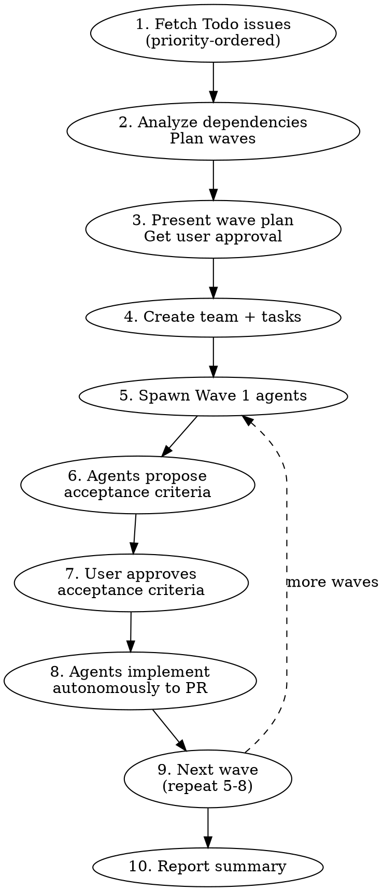

# Linear Todo Runner

## Overview

Work through all Todo tickets in a Linear team. Fetches issues, analyzes dependencies, groups into parallelizable waves by priority, and orchestrates agents — each with its own worktree — pausing for acceptance criteria approval before implementation.

## When to Use

- 2+ issues in Todo state ready to work on
- You want to maximize throughput across your backlog
- User says "run through my tickets", "work my todos", etc.

## When NOT to Use

- Single ticket — use `starting-linear-ticket` directly
- All issues are tightly coupled and sequential
- Issues need design decisions before scoping

## Process



### Step 1: Fetch Todo Issues

Fetch all issues with state "Todo" for the team:

```
mcp__linear-server__list_issues with team: "<team-name>", state: "Todo"
```

Use `get_issue` on each to get full descriptions.

Sort by Linear priority: Urgent (1) → High (2) → Medium (3) → Low (4).

Extract per issue: identifier, title, full description, priority, labels, project (if any).

### Step 2: Analyze Dependencies

Read every issue's full description. Group into **waves** based on:
- Explicit blocking relationships in Linear
- Implicit dependencies from descriptions (e.g., "table must exist before frontend can query it")
- Shared code areas that would cause merge conflicts if worked simultaneously
- Priority — higher priority issues go in earlier waves

**Wave 1:** Highest-priority issues with no dependencies — can all start immediately
**Wave 2+:** Issues that depend on Wave 1 completing, or lower-priority independent issues

Within each wave, cap at 4 agents (resource constraint).

### Step 3: Present Wave Plan for Approval

Show the user:
- Which issues are in each wave, with priority and labels
- Which area each issue targets (pipeline, frontend, both)
- How many agents will run in parallel per wave
- Any dependency reasoning

**Wait for user approval before proceeding.**

### Step 4: Create Team and Tasks

```
TeamCreate → team name: "todo-runner"
```

Create a TaskCreate entry for each issue. Set up `addBlockedBy` relationships matching the wave plan.

### Step 5: Spawn Wave Agents

For each issue in the current wave:

1. **Mark the Linear issue as "In Progress"** immediately when spawning the agent
2. Spawn the agent

```
mcp__linear-server__update_issue with id and state: "In Progress"
```

```
Task tool:
  subagent_type: "general-purpose"
  team_name: "todo-runner"
  name: "agent-{issue-identifier}"  (e.g., "agent-nex-170")
  mode: "default"
```

**Agent prompt template:**

```
You are working on Linear issue {IDENTIFIER}: "{TITLE}"

## Issue Description
{FULL_DESCRIPTION}

## Phase 1: Acceptance Criteria (STOP after this)

Read the issue description and explore the relevant codebase. Then propose
specific, testable acceptance criteria for this issue. Format as a numbered
checklist.

Send your proposed acceptance criteria back to the team lead using SendMessage.
Do NOT proceed to implementation until the team lead approves your criteria.

## Phase 2: Implementation (after approval)

Once your acceptance criteria are approved, follow the `starting-linear-ticket`
skill workflow with these modifications:

- **Skip Steps 1-2** (fetch ticket, mark In Progress) — the lead already did this.
- **Skip Step 4** (brainstorm) — use the approved acceptance criteria as your design.
- **Start at Step 3** (create worktree) and continue through Step 11.
  - Worktree: git worktree add {WORKTREE_PATH} -b {BRANCH_NAME} origin/main
  - If the project has multiple repos, create worktrees FROM each repo's directory.

After Step 11 (Linear updated to In Review), also:
- Send PR URL, code review summary, and implementation summary to team lead via SendMessage.

## Important
- Check the installed version of frameworks in package.json before making
  assumptions about API conventions
- Use pnpm for frontend, uv for Python projects
- NEVER commit to main
- NEVER mark Linear as "In Review" until CI passes
```

### Step 6-7: Acceptance Criteria Approval

Each agent sends proposed acceptance criteria via SendMessage. The lead:

1. Receives criteria from each agent
2. Presents ALL criteria to the user at once (batch review)
3. User approves, modifies, or rejects each
4. Lead sends approval (or revised criteria) back to each agent via SendMessage

**Batch when possible** — if 3 agents in Wave 1 all send criteria, present them together for one review pass.

### Step 8: Agents Implement

After approval, agents proceed autonomously through implementation → test → PR → code review.

Agents should run the `superpowers:code-reviewer` on their own PR and fix Critical/Important issues before reporting back.

Monitor via TaskList. If an agent reports a blocker, help resolve it.

### Step 9: Review, Merge, Then Next Wave

**Do NOT start the next wave until the current wave's PRs are merged.**

When all agents in a wave complete:
1. **Run code review** on each PR using `superpowers:code-reviewer` agent (if agents didn't already). Fix Critical/Important issues, push fixes.
2. Present all PRs and code review findings to the user for review
3. User reviews PRs (in GitHub or via diffs)
4. Address any review feedback — send fixes back to agents or fix directly
5. **Wait for user to approve and merge** each PR
5. Merge PRs: `gh pr merge <number> --squash --delete-branch`
6. Clean up worktrees for merged PRs
7. Update Linear issues to "Done"
8. **Only then** spawn the next wave's agents (repeat steps 5-8)

This ensures each wave builds on merged, verified code from the previous wave — not just open PRs.

### Step 10: Report Summary

When all waves complete, report:

| Issue | PR | CI Status |
|-------|-----|-----------|
| PROJ-170 | #42 | passing |
| PROJ-171 | #43 | passing |
| ... | ... | ... |

Shut down team: SendMessage type "shutdown_request" to each agent, then TeamDelete.

## Key Rules

- **Priority ordering** — Urgent → High → Medium → Low determines wave placement; higher priority issues go first
- **Merge before next wave** — do NOT spawn Wave N+1 until Wave N's PRs are reviewed, approved, and merged by the user
- **Max 4 agents simultaneously** — resource constraints
- **Each agent gets its own worktree** — no shared workspace
- **Agents STOP after proposing acceptance criteria** — user must approve before implementation
- **User approves wave plan before spawning** — no surprises
- **Multi-repo projects** — create worktrees from within each repo's directory, not a parent directory
- **Preserve existing Linear labels** when updating issue status
- **Lead NEVER does implementation directly** — all work (code, tests, fixes, CI debugging) must be delegated to agents or subagents. The lead coordinates, reviews, and communicates with the user.

## Quick Reference

| Step | Action | Tool |
|------|--------|------|
| Fetch issues | Get all Todo issues for team | `mcp__linear-server__list_issues` state: "Todo" |
| Full descriptions | Get each issue's full text | `mcp__linear-server__get_issue` |
| Analyze | Group into priority-ordered waves | Manual analysis |
| Wave plan | Present to user | Direct output |
| Create team | Set up coordination | `TeamCreate` + `TaskCreate` |
| Spawn agents | One per issue | `Task` (general-purpose) |
| AC approval | Batch review with user | `SendMessage` + `AskUserQuestion` |
| Monitor | Track progress | `TaskList` + `TaskUpdate` |
| Report | Summary table | Direct output |
| Cleanup | Shut down team | `SendMessage` (shutdown) + `TeamDelete` |
