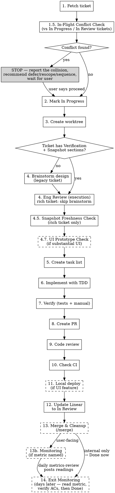

# Starting Work on a Linear Ticket

## Overview

Complete end-to-end workflow for Linear tickets: fetch → in progress → worktree → brainstorm → (UI prototype) → task list → TDD → verify → PR → code review → CI → in review.

**Announce at start:** "I'm using the starting-linear-ticket skill to set up for this ticket."

## Ticket Ownership — Drive to PR, Don't Stop Between Steps

Whoever runs this workflow — you, or an agent spawned to execute it — is the **end-to-end owner of the ticket**. The deliverable is a PR with green CI and Linear in "In Review", not a partially completed task list. Finishing a step, a task-list item, or a subtask is NOT a stopping point: mark it done and proceed to the next step immediately, in the same turn.

**Stop ONLY at the explicit checkpoints this workflow defines:**

| Checkpoint | Why it stops |
|---|---|
| Step 1 — ticket has no acceptance criteria | User must supply them |
| Step 1.5 — Sequencing or Blocked conflict verdict | User's call to override |
| Step 4 Path B — brainstorming questions | Needs user answers |
| Step 4.7 — UI prototype sign-off | User approves the look |
| Step 9 — code review findings presented | User sees review before CI |
| Step 11 — local deploy for manual testing (UI only) | User tests the change |
| Step 13 — merge | NEVER merge without explicit approval |
| A blocker you genuinely cannot resolve | Escalate with what you tried |

Between those checkpoints, keep going without reporting back or waiting. A one-line status update mid-work is fine; ending your turn is not. "I finished the X subtask" is never a reason to stop — subtasks are internal structure, not deliverables. If you catch yourself writing a progress summary followed by "next I'll…", that next step is yours to do right now.

## Required Input

User provides ticket identifier (e.g., "PROJ-63", "start PROJ-63", or just the number if context is clear).

## When to Use a Team

Before starting the workflow, evaluate whether this work should use a **team of parallel agents**. Use a team when:

### Use a Team When

- **Multiple independent tickets** — User asks to work on 2+ tickets at once. Each agent gets its own worktree and runs the full workflow independently.
- **Cross-repo changes** — A single ticket requires changes across multiple repos. Each agent works in a different repo/worktree.
- **Large ticket with independent subtasks** — A ticket has clearly separable pieces (e.g., "add 3 new API endpoints" where each endpoint is independent).

### Don't Use a Team When

- **Single ticket, single repo** — Standard workflow is sufficient.
- **Tightly coupled changes** — Work where each step depends on the previous step's output (e.g., schema change → backend update → frontend update in sequence).
- **Small or quick tickets** — The overhead of team coordination exceeds the benefit.

### Team Setup

When using a team, the lead agent should:

1. **Fetch all tickets** from Linear first to understand scope and dependencies
2. **Create a team** with `TeamCreate`
3. **Create tasks** from ticket requirements with `TaskCreate`
4. **Spawn teammate agents** with `Task` tool (`subagent_type: "general-purpose"`, include `team_name`; add `model: "opus"` if the lead is running on Fable — see Step 6 model selection)
   - Each teammate gets: ticket ID, requirements, acceptance criteria, target repo, branch name
   - Each teammate runs the full workflow (worktree → brainstorm → TDD → verify → PR → code review)
5. **Coordinate** — monitor progress, resolve blockers, handle cross-repo dependencies
6. **Report back** — collect PR URLs and update all Linear tickets

### Team Agent Naming

Name agents by their responsibility:
- `proj-140-agent` — for ticket-based agents
- `frontend-agent` / `backend-agent` / `pipeline-agent` — for repo-based agents

### Example: Multiple Tickets

```
User: "Start PROJ-140, PROJ-141, and PROJ-142"

Lead:
  1. Fetch all 3 tickets from Linear
  2. Verify they're independent (no blocking dependencies)
  3. Mark all 3 as "In Progress"
  4. TeamCreate → "proj-batch"
  5. Spawn 3 agents, each with full ticket context
  6. Each agent: worktree → brainstorm → TDD → verify → PR → code review
  7. Lead collects PRs, updates Linear to "In Review"
```

### Example: Cross-Repo Ticket

```
User: "Start PROJ-150" (requires changes across multiple repos)

Lead:
  1. Fetch ticket, brainstorm overall design
  2. Identify which changes go to which repo
  3. TeamCreate → "proj-150"
  4. Spawn agents per repo with their slice of the design
  5. Define task dependencies (e.g., backend blocked by schema changes)
  6. Each agent creates a PR in their respective repo
  7. Lead links all PRs in Linear ticket
```

## Workflow



### Step 0: Resolve the Linear server

Two Linear MCP servers exist (`mcp__linear-server__*` and the UUID-prefixed connector
`mcp__5afa51ff-6015-498e-9e18-a1d1d62866c2__*`); they fail independently and the startup auth
reminder only describes the first. Run `ToolSearch "get_issue save_issue list_issues save_comment"`
(bare verbs, never the word "linear") and use whichever prefix comes back for every
`mcp__linear-server__…` call below. Only an empty result from that search means Linear is unavailable.

### Step 1: Fetch Ticket from Linear

```
mcp__linear-server__get_issue with id: "<ticket-id>"
```

Extract and summarize:
- **Title**
- **Description** (requirements, acceptance criteria)
- **Labels** (Bug, Feature, Improvement)
- **Priority**
- **Any linked issues or dependencies**

If ticket not found or MCP timeout: ask user to verify ticket ID or run `/mcp`.

**Check for acceptance criteria.** If the ticket does NOT have clear acceptance criteria (specific, testable conditions that define "done"), STOP and ask the user to provide them before proceeding. Do not invent acceptance criteria or proceed without them — they drive the design, tests, and verification steps downstream.

### Step 1.5: In-Flight Conflict Check (mandatory, before marking In Progress)

**Never start a ticket without first checking what it collides with.** Every other ticket already in
flight is invisible from inside this ticket's description — the ticket text was written before those
branches existed and cannot warn you. Run the probes in `conflict-check.md`, which cover the four
collision classes:

1. **File overlap** — the files this ticket must touch are already modified on an in-flight branch.
2. **Shared production resource** — both tickets write the same prod table, ledger, cron, schema
   object, or external config. Git shows nothing; the collision is at apply time.
3. **Mechanism change under an in-flight dependent** — this ticket changes or gates a pipeline that
   an in-flight ticket is queued to ride through (migration auto-apply, deploy path, publish gate).
   The dependent silently stops working.
4. **Wide mechanical churn** — mass renames/moves/codemods that force a painful rebase on every
   open branch, even with zero textual overlap.

Classes 2 and 3 are the ones that actually bite, and neither is visible in a `git diff`. Do not
reduce this step to a filename comparison.

Enumerate in-flight work from **both** Linear and the local checkout — each sees things the other
misses (a Linear ticket with no branch yet; a worktree whose ticket was never moved out of Todo):

```
mcp__linear-server__list_issues with:
- team: "<team-name>"
- state: "In Progress"     # repeat for "In Review"
- fields: ["id", "title", "status", "gitBranchName", "updatedAt"]
```

```bash
git worktree list
gh pr list --state open --json number,title,headRefName,files
```

**Verdict — report all three fields explicitly, never a bare "no conflict":**

| Verdict | Meaning | Action |
|---|---|---|
| **Clear** | No overlap in any of the four classes | Proceed to Step 2 |
| **Sequencing** | Safe only in a specific order, or safe for part of the scope | **STOP.** Name which phase is blocked, by what, and what unblocks it. Recommend a scoping. Wait for the user. |
| **Blocked** | Cannot proceed without breaking in-flight work | **STOP.** Report and recommend deferring. Wait for the user. |

On **Sequencing**, the usual right answer is to start the safe phases now and hold the colliding one
— say precisely where the line falls rather than blocking the whole ticket. Deciding to proceed
through a known collision is the user's call, not yours. If they say proceed, record the accepted
collision in the ticket so the other ticket's owner can see it.

### Step 2: Mark as In Progress

```
mcp__linear-server__update_issue with:
- id: "<ticket-id>"
- state: "In Progress"
```

Preserve existing labels (Bug/Feature/Improvement).

### Step 3: Create Git Worktree

**REQUIRED:** Invoke `superpowers:using-git-worktrees` skill.

Use branch name from Linear if available (`branchName` field), otherwise generate:
- Feature: `feature/<prefix>-<number>-<slug>`
- Bug: `fix/<prefix>-<number>-<slug>`
- Improvement: `improve/<prefix>-<number>-<slug>`

Where `<slug>` is kebab-case from ticket title.

### Step 4: Design Pass (Conditional Brainstorm + Eng Review)

**Inspect the ticket for new-template sections:**

- `## Verification` (with Observable Signals + Test Scenarios + Post-Merge Verification)
- `## Implementation Snapshot` (with `As of <SHA>` marker)

**Path A — Ticket has both sections (rich ticket from `creating-linear-tickets`):**
- **Skip `superpowers:brainstorming`.** The ticket already encodes intent, observable signals, and codebase anchors. Asking clarifying questions defeats the autonomy goal.
- Go directly to `plan-review-eng` in **execution mode** for a sanity pass on the snapshot-anchored approach. The reviewer reads the ticket's Snapshot + Verification, looks at the actual files, and surfaces edge cases / perf concerns / test gaps the ticket creator couldn't see.
- If the eng review surfaces a real ambiguity (not just suggestions), STOP and escalate to the user. Otherwise proceed to Step 4.5.

**Path B — Ticket is missing Verification or Implementation Snapshot (legacy / hand-written):**
- **REQUIRED:** Invoke `superpowers:brainstorming` skill (current behavior).
  - Ask clarifying questions one at a time
  - Propose 2-3 approaches with trade-offs
  - Present design incrementally for validation
  - Write design doc to `docs/plans/YYYY-MM-DD-<topic>-design.md`
- Then invoke `plan-review-eng` in **execution mode**.

**Both paths produce:** edge cases to handle, codepath diagram with test coverage mapping, perf concerns, and an updated test plan matching the acceptance criteria. The test plan feeds Step 6 (TDD implementation).

### Step 4.5: Snapshot Freshness Check (Path A only)

The Implementation Snapshot in the ticket was captured at ticket-creation time. Before trusting it, run the lightweight probes in `freshness-check.md`:

- Each path under "Files to modify" / "Files to create" exists (or is correctly marked as new).
- Each "see `<symbol>` in `<path>`" reference still resolves (grep for the symbol at that path).
- Each "Schema touched" column still exists (one Supabase MCP query against `information_schema.columns`).

**If all probes pass:** trust the snapshot. Proceed.

**If any probe fails:** spawn a Rescue Scout subagent (Agent tool, `subagent_type: "general-purpose"`, brief from `~/.claude/skills/creating-linear-tickets/scout-prompt.md` "Rescue Scout" mode). It refreshes only the broken anchors and writes the refreshed snapshot to `<worktree>/SNAPSHOT.md`. The Linear ticket is NOT updated — the durable spec hasn't changed.

After rescue, the implementing agent uses the refreshed snapshot for the rest of the workflow.

### Step 4.7: UI Prototype Check (conditional — visually substantial UI only)

**When:** The ticket introduces or significantly reworks user-facing UI — a new page, a redesigned surface, new card/list layouts, a non-trivial component. **Skip when:** backend/pipeline-only work, type-only changes, copy tweaks, or small CSS adjustments — the cost isn't worth it there.

**Why:** A 5-minute throwaway prototype catches "this isn't the layout I pictured" *before* you've written components, tests, and an approval flow against the wrong design. Wrong-look corrections after the build are the expensive ones.

**How:**
1. Build a single self-contained throwaway artifact (one HTML file with inline CSS/JS is usually enough; or a quick Storybook/page stub) that renders the proposed layout. **Use real data where you can** — query the actual DB / API so the look is faithful to production content, not lorem-ipsum. Keep it disposable; this is not production code and gets no tests.
2. Render it and capture screenshots at **both** the project's desktop and mobile breakpoints (e.g. 1280×800 + 375×812). Drive a real browser (claude-in-chrome MCP or a local static server) — don't reason about the look from the source.
3. Present the screenshots to the user and **get explicit sign-off on the look** (layout, hierarchy, lanes, wording) before proceeding. Fold any requested changes into the prototype and re-confirm.
4. Only then continue to the task list. The signed-off prototype becomes the visual reference for implementation — but the production build still follows TDD and the project's UI e2e rules (e.g. `boundingBox()` checks); the prototype does not replace those.

Delegate the prototype build to a subagent when the data is large or the artifact is involved (keeps the dataset out of the lead's context). The lead drives the browser screenshots and the user sign-off.

### Step 5: Create Task List

**REQUIRED:** Before writing any code, create a `TaskCreate` todo list that breaks the design into implementation tasks.

Based on the design from brainstorming, create tasks for:
- Each piece of functionality to implement (API endpoints, components, pages, etc.)
- A verification task (run full test suite + TypeScript + build)
- A PR creation task

Set up dependencies with `TaskUpdate` (e.g., verification blocked by implementation tasks, PR blocked by verification).

Update task status as you work: `in_progress` when starting, `completed` when done. This gives the user visibility into progress.

### Step 6: Implement with Subagents

**REQUIRED:** Use subagents (Task tool) to implement each task from the task list.

After creating the task list in Step 5, dispatch implementation tasks to subagents:

1. **Identify independent tasks** — tasks that don't depend on each other can run in parallel
2. **Dispatch each task** using `Task` tool with `subagent_type: "general-purpose"`
   - **Model selection:** check which model YOU (the main agent) are running on — your system prompt states it. If you are Fable (`claude-fable-5`), pass `model: "opus"` on every implementation dispatch so implementation runs on Opus. On any other model, omit `model` (subagents inherit yours).
3. **Include full context** in each subagent prompt:
   - The worktree path (so they edit the right files)
   - Which files to modify and what changes to make
   - The acceptance criteria for that task
   - Instructions to follow TDD (RED → GREEN → REFACTOR)
4. **Run independent tasks in parallel** — launch multiple Task calls in a single message
5. **Run dependent tasks sequentially** — wait for blockers to complete first
6. **Update task status** — mark tasks `completed` as subagents finish

**Subagent prompt template:**
```
You are working in the worktree at: <worktree-path>

Task: <task description>

Files to modify:
- <file path> — <what to change>

Acceptance criteria:
- <criterion 1>
- <criterion 2>

## How to Work

1. Read the project's `.claude/CLAUDE.md` — it has a "Verification Commands"
   section with the exact commands you must run. These mirror CI.
2. Follow TDD:
   a. Write failing test first
   b. Implement minimal code to pass
   c. Refactor if needed

## Verification Gate (mandatory before reporting success)

Run ALL verification commands from the project's `.claude/CLAUDE.md`.
Every check must pass.

If any check fails:
1. Read the error output carefully
2. Diagnose the root cause (wrong approach vs. bug)
3. Fix the issue
4. Re-run ALL checks
5. Repeat up to 3 attempts

## Escalation

If after 3 fix attempts a check still fails, STOP and report back with:
- Which check is failing
- The exact error output
- What you tried (all 3 attempts)
- Your hypothesis for why it's still failing

Do NOT report success if any verification check is failing.

## Report Format

When done, report:
- What you implemented
- What you tested and verification gate results (all checks)
- Files changed
- Any concerns
```

**When NOT to use subagents:**
- Tasks that require back-and-forth with the user (clarification, approval)
- Tasks where you need to see the result before deciding next steps
- Very small changes (1-2 line edits) where the overhead isn't worth it

**Note on test types:** Unit tests are preferred when possible. For UI/visual bugs where e2e tests are flaky or unreliable, document that manual testing will be used in Step 7.

### Step 7: Verify Before Completion

**REQUIRED:** Invoke `superpowers:verification-before-completion` skill, or dispatch a Bash subagent to run verification.

**Automated verification:**
Run ALL commands from the project's `.claude/CLAUDE.md` → "Verification Commands" section. These mirror CI exactly and include tests, type checking, linting, and any project-specific checks. Every command must pass.

**E2E tests (REQUIRED if they exist):**
If the project has E2E tests:
1. Start required servers (e.g., `langgraph dev`, `npm run dev`)
2. Run E2E test suite (e.g., `pytest tests/*_e2e.py -v -s`)
3. Wait for all E2E tests to pass before creating PR
4. Stop servers after tests complete

**Chat/agent backend changes:**
When modifying agent behavior (system prompt, tool routing, fallback logic, tools), write E2E tests that verify the agent makes the right tool calls with the right arguments. See the project's `testing-langgraph-backend` skill if available.

**Manual verification (for UI/visual bugs):**
If the bug is visual or e2e tests are unreliable:
1. Start required servers locally (backend + frontend)
2. Reproduce the original bug scenario
3. Verify the fix works
4. Document what was tested in the PR description

**Local deploy for user manual testing:**
For UI features, new pages, or any user-facing changes — after creating the PR and running code review, offer to deploy locally so the user can manual test:
1. Ensure required services are running (e.g., `supabase status`)
2. Copy `.env.local` from main repo to worktree if missing
3. Start the dev server in the worktree: `npm run dev` (run in background)
4. Tell the user the URL (e.g., `http://localhost:3000`) and what to test
5. Wait for user feedback before marking as "In Review"
6. Stop the dev server after user confirms testing is complete

### Step 8: Create Pull Request

Push branch and create PR:

```bash
git push -u origin <branch-name>

gh pr create --title "<PROJ>-<number>: <ticket-title>" --body "$(cat <<'EOF'
## Summary
<2-3 bullets from the design doc>

## Test Plan
- [ ] <verification steps from TDD>

## Linear
<PROJ>-<number>

🤖 Generated with [Claude Code](https://claude.com/claude-code)
EOF
)"
```

Capture the PR URL from output.

### Step 9: Code Review

**REQUIRED:** Invoke `superpowers:requesting-code-review` skill OR use the `superpowers:code-reviewer` agent.

After creating the PR, run a code review before checking CI. This catches logic errors, security issues, missing edge cases, and style problems early — before CI runs and before marking as "In Review".

**How to run the review:**
- Use the Task tool with `subagent_type: "superpowers:code-reviewer"` to spawn a review agent
  - **Model selection:** same rule as Step 6 — if you are running on Fable, pass `model: "opus"` on the review agent spawn; otherwise omit `model`.
- Provide the PR number, worktree path, and a summary of what was changed
- The reviewer will read the diff and report issues categorized as Critical / Important / Suggestion

**After review:**
- **Critical issues** — must fix before proceeding. Push fixes, re-run review if needed.
- **Important issues** — should fix. Push fixes.
- **Suggestions** — nice to have. Fix if quick. If genuinely deferring, any follow-up ticket goes through the `creating-linear-tickets` skill (its Three Gates decide whether it's a real ticket or work that belongs in this one).

Present the review findings to the user for their own review before proceeding. Do NOT skip ahead — the user should see the review results and approve before moving to CI.

### Step 10: Check CI

After code review is addressed, verify CI checks pass before marking as In Review:

```bash
gh pr checks <pr-number> --watch
```

- If checks **pass**: proceed to Step 11
- If checks **fail**: read the failure logs with `gh run view <run-id> --log-failed`, fix the issue, push, and re-check
- Don't leave a PR in "In Review" with failing CI — fix it first

```bash
# View failure details
gh run view <run-id> --repo <owner/repo> --log-failed
```

### Step 11: Local Deploy for Manual Testing

**When:** The ticket involves UI features, new pages, or user-facing changes.
**Skip when:** Backend-only changes, type-only changes, or no visual component.

1. Ensure required services are running (e.g., `supabase status`)
2. Copy `.env.local` from main repo to worktree if missing
3. Start the dev server in the worktree (`npm run dev`, run in background)
4. Tell the user the URL and what to test (specific flows from acceptance criteria)
5. Wait for user feedback before proceeding
6. Fix any issues found during manual testing
7. Stop the dev server after user confirms

### Step 12: Update Linear to In Review

```
mcp__linear-server__update_issue with:
- id: "<ticket-id>"
- state: "In Review"
- description: append PR link to existing description
```

Report completion with PR URL.

## Quick Reference

| Step | Action | Skill/Tool |
|------|--------|------------|
| 1 | Fetch ticket | `mcp__linear-server__get_issue` |
| 1.5 | In-flight conflict check | Probes from `conflict-check.md` → Clear / Sequencing / Blocked. Sequencing or Blocked = STOP and escalate. |
| 2 | Mark in progress | `mcp__linear-server__update_issue` |
| 3 | Create worktree | `superpowers:using-git-worktrees` |
| 4 | Design Pass (conditional) | If ticket has Verification + Snapshot → `plan-review-eng` only. Else `superpowers:brainstorming` then `plan-review-eng`. |
| 4.5 | Snapshot Freshness Check (Path A) | Probes from `freshness-check.md`. On failure: Rescue Scout writes `<worktree>/SNAPSHOT.md`. |
| 4.7 | UI Prototype Check (if substantial UI) | Throwaway prototype with real data → screenshot desktop+mobile → user signs off on the look before TDD |
| 5 | Create task list | `TaskCreate` + `TaskUpdate` for dependencies |
| 6 | Implement | Subagents (`Task` tool, `general-purpose`; `model: "opus"` if the main agent is Fable) with TDD |
| 7 | Verify (unit + E2E + manual) | Subagent (`Bash`) or `superpowers:verification-before-completion` |
| 8 | Create PR | `gh pr create` |
| 9 | Code review | Project `scaled-code-review` skill (if exists) OR `superpowers:code-reviewer` agent (`model: "opus"` if the main agent is Fable) |
| 10 | Check CI | `gh pr checks --watch` → fix failures if any |
| 11 | Local deploy (if UI) | `npm run dev` in worktree → user manual tests → wait for feedback |
| 12 | Update Linear | `mcp__linear-server__update_issue` → In Review |
| 13 | Merge, Deploy & Cleanup | Project `land-and-deploy` skill (if exists) OR `gh pr merge --squash` → deploy verify → canary → **Linear `Monitoring`** (or `Done` if nothing to measure) → worktree remove → pull main |
| 14 | Exit Monitoring (days later) | Re-read every AC with evidence + read the metric directionally → `Done`, or back to `In Progress` on a regression. Never on elapsed time alone. |

## Common Mistakes

### Skipping brainstorming when the ticket is missing Verification or Implementation Snapshot
- **Problem:** Jumps into implementation without understanding requirements; the ticket alone doesn't carry enough context
- **Fix:** Brainstorm whenever the ticket is missing the new sections (Path B). Only skip brainstorming when the ticket has both Verification AND Implementation Snapshot — those sections are what justify the skip.

### Trusting a stale Implementation Snapshot
- **Problem:** Snapshot listed file paths or symbols that have since moved or been renamed; agent edits the wrong file or reinvents a helper that's been refactored
- **Fix:** Always run the Step 4.5 freshness check on rich tickets. If any probe fails, spawn the Rescue Scout — don't paper over a broken anchor.

### Starting a ticket without checking what's already in flight
- **Problem:** The ticket description was written before the other branches existed and cannot warn you about them. The collisions that hurt — two migrations redefining one function, a bulk repair whose snapshot misses a mid-flight merge, a gate change that silently orphans a queued migration — are all invisible in `git diff`.
- **Fix:** Run Step 1.5 before marking In Progress. Check all four classes, not just filenames.

### Reporting "no conflict" after comparing only filenames
- **Problem:** File overlap is the class that *does* show up in review anyway. Shared prod resources and mechanism changes are the ones that ship broken.
- **Fix:** Name which of the four classes you checked. A verdict that doesn't say what was examined isn't a verdict.

### Forgetting to mark ticket In Progress
- **Problem:** Team doesn't know work has started
- **Fix:** Mark In Progress immediately after fetching

### Working in main directory instead of worktree
- **Problem:** Pollutes main with in-progress work
- **Fix:** Always create worktree before making changes

### Skipping task list before implementation
- **Problem:** No visibility into progress, user can't see what's being worked on
- **Fix:** Always create tasks from the design BEFORE writing any code. Update status as you work.

### Implementing tasks sequentially instead of with subagents
- **Problem:** Doing each task yourself blocks the main context and is slower
- **Fix:** Dispatch independent implementation tasks to subagents in parallel. Use `Task` tool with `subagent_type: "general-purpose"` (plus `model: "opus"` if the main agent is Fable) and include full context (worktree path, files to modify, acceptance criteria).

### Skipping TDD for "urgent" tickets
- **Problem:** Untested code ships with bugs
- **Fix:** TDD is faster than debugging in production

### Relying only on e2e tests for UI bugs
- **Problem:** E2e tests can be flaky due to timing, backend connectivity, etc.
- **Fix:** Always do manual verification for visual/UI bugs - start the servers and test it yourself

### Skipping manual testing because "tests pass"
- **Problem:** Tests may not cover the exact user scenario
- **Fix:** For UI bugs, reproduce the original issue and verify it's fixed

### Skipping E2E tests before merging
- **Problem:** Unit tests pass but integration/agent behavior may be broken
- **Fix:** Always run E2E tests before creating PR - start the server and run the full E2E suite

### Modifying chat/agent behavior without writing E2E tests
- **Problem:** System prompt, tool routing, or fallback changes break agent behavior in ways unit tests can't catch
- **Fix:** Write E2E tests that verify the agent calls the right tools with the right arguments. Run them against the dev server before creating the PR.

### Skipping code review before CI
- **Problem:** Issues found after CI passes, requiring another push/CI cycle
- **Fix:** Always run the `superpowers:code-reviewer` agent after creating the PR (`model: "opus"` if the main agent is Fable). Fix Critical/Important issues before checking CI. Present findings to user for their review.

### Marking PR as "In Review" without checking CI
- **Problem:** PR has failing CI, reviewer wastes time reviewing broken code
- **Fix:** Always run `gh pr checks --watch` after pushing. Fix failures before marking In Review.

### Working on multiple independent tickets sequentially
- **Problem:** 3 independent tickets take 3x as long when done one-by-one
- **Fix:** Use a team — spawn parallel agents, each with their own worktree. The lead coordinates and collects PRs.

### Using a team for tightly coupled sequential work
- **Problem:** Agents block each other waiting for dependencies, adding coordination overhead with no parallelism benefit
- **Fix:** Only use teams when work is genuinely independent. Sequential dependencies = single-agent workflow.

## Red Flags

- "Nothing else is in flight, I'd have noticed" (run Step 1.5 — the Linear list and `git worktree list` each catch what the other misses)
- "Different files, so no conflict" (that's one of four classes; shared prod resources and mechanism changes don't show in a diff)
- "The collision is minor, I'll just be careful" (a Sequencing verdict is the user's call to override, not yours)
- "This is simple, I don't need to brainstorm"
- "Let me just make a quick fix in main"
- "I'll write tests after"
- "I'll create the task list later" (create it BEFORE implementation, not after)
- "The ticket is clear enough"
- "I can figure out the acceptance criteria myself"
- "Unit tests pass, E2E tests can wait"
- "The code looks fine, I don't need a review"
- "I'll just build the real UI — a prototype is a waste" (for substantial new UI, prototype + get look sign-off FIRST; wrong-look rebuilds cost far more)
- "CI will probably pass, I'll mark it In Review now"
- "I'll do these 3 tickets one at a time" (if they're independent, use a team)
- "I'll implement each task myself" (dispatch to subagents for parallelism)
- "This cross-repo ticket is too complex for a team" (it's exactly when teams help most)
- "The PR is merged, we're done" (still need: Linear state, worktree cleanup, pull main)
- "It shipped, mark it Done" (if it named a metric, it goes to `Monitoring` — shipping is not the outcome)
- "It's been a week in Monitoring, close it" (elapsed time is not a result — read the metric)
- "The metric moved, ship it as Done" (re-read EVERY acceptance criterion first, not just the metric)
- "Linear already flipped it to Done on merge, so it must be fine" (that's the GitHub integration, not a verification)
- "I'll file a follow-up for the rest and close this one" (goal-completing work — remediation, measurement, e2e — stays in THIS ticket; an AC is never satisfied by filing a ticket for it)
- "That subtask is done — good stopping point, I'll report back" (subtasks are internal structure; you own the ticket to PR — keep going)
- "I'll pause here in case the user wants to redirect" (the checkpoints where the user weighs in are enumerated; this isn't one of them)
- "Let me summarize progress and outline next steps" (if you can outline the next step, do it now instead)

**All of these mean: Follow the workflow. No shortcuts.**

### Step 13: Merge, Deploy & Cleanup

**Trigger:** User says "merge", "merge the PR", or "ship it". Can also be invoked directly mid-conversation for any open PR.

**This is the complete end-of-ticket ceremony. Execute all steps in order — don't skip any.**

**Project override:** If the project has a `land-and-deploy` skill, invoke it instead of following the steps below. The project skill handles deploy monitoring and canary verification specific to that project's infrastructure.

1. **Confirm PR number** with the user if ambiguous (multiple PRs open)

2. **Verify CI is green:**
   ```bash
   gh pr checks <pr-number>
   ```
   If checks are failing, fix first — do NOT merge with red CI.

3. **Merge the PR:**
   ```bash
   gh pr merge <pr-number> --squash --delete-branch
   ```

4. **Monitor deploy** (if project has deploy infrastructure):
   - Wait for deployment to complete (check GitHub deployment status or platform CLI)
   - Verify deployment succeeded before proceeding

5. **Canary verification** (if project has a `canary` skill):
   - Invoke the project's `canary` skill to verify production health
   - If canary reports degradation, alert user and offer revert
   - If healthy, proceed to cleanup

6. **Stop any running servers** started during verification (dev servers, Supabase, etc.)

7. **Clean up worktree:**
   ```bash
   git worktree remove <worktree-path> --force
   ```

8. **Return to main and pull latest:**
   ```bash
   cd <main-repo-path>
   git checkout main
   git pull origin main
   ```

9. **Close-time AC audit (mandatory before ANY state change):**

   Enumerate every acceptance criterion in the ticket and mark each one: **met** (with evidence), **dropped** (deliberately cut, with user sign-off, recorded in a Linear comment), or **deferred**.

   - **Any AC "deferred to a follow-up ticket" means the ticket is NOT closeable.** An AC is never satisfied by filing a ticket for it. Either the work happens in this ticket (stay `In Progress`), or the AC is explicitly dropped on the record.
   - Remediation of existing bad data, the measurement/baseline for the change, and e2e coverage for shipped behavior are goal-completing ACs — they cannot be deferred out.
   - Post the audit as a Linear comment: `AC audit: 1 ✅ (evidence), 2 ✅ (evidence), 3 ❌ dropped per user 2026-07-30`.

10. **Update Linear — `Monitoring`, NOT `Done`, if the ticket names a metric:**

   Decide which state the ticket lands in:

   | Ticket changes… | Land in | Why |
   |---|---|---|
   | User-facing behavior with a named metric in its ACs | **`Monitoring`** | The metric hasn't been read yet. Shipping ≠ working. |
   | Internal only — refactor, types, tooling, docs, CI | **`Done`** | Nothing to measure. |

   ```
   mcp__linear-server__get_issue with id: "<ticket-id>"
   mcp__linear-server__update_issue with:
   - id: "<ticket-id>"
   - state: "Monitoring"   # or "Done" for unmeasurable work
   ```
   Preserve existing labels (Bug/Feature/Improvement).

   **A ticket in `Monitoring` is not finished.** It leaves `Monitoring` only when a
   human reads the metric and decides. The `metrics-review` scheduled task posts a
   daily reading on every `Monitoring` ticket; it never moves tickets itself.

11. **Report completion:** Confirm to user: PR merged, deploy verified, AC audit posted, Linear state set, worktree cleaned. If the ticket went to `Monitoring`, say which metric is being watched and roughly when it should be readable.

**Don't leave worktrees hanging** — they consume disk space and cause confusion in future sessions.

---

### Step 14: Exit Monitoring (days later, not in the shipping session)

Triggered by the daily `metrics-review` comment showing enough accumulated data, or by the user asking where a shipped ticket stands.

1. **Re-read the ticket's acceptance criteria.** Every one, not just the metric.
2. **Confirm each AC with evidence.** A merged PR is not evidence. A passing test is not evidence that production behaves. **An AC that was "handled" by filing a follow-up ticket is NOT met** — the ticket goes back to `In Progress` (or the AC is dropped on the record with user sign-off).
3. **Read the metric directionally.** At low traffic there is no significance to find — judge slope and funnel health, not p-values. Name any confounder that shipped in the same window; if one exists, say the read is unattributable rather than claiming a result.
4. **Then decide:**
   - Metric moved the right way and all ACs met → **`Done`**
   - Metric regressed → **`In Progress`** (or revert), with the numbers in a comment
   - Not enough data yet → leave in `Monitoring`, note what you're still waiting for
5. **Never flip to `Done` on elapsed time alone.** "It's been a week" is not a result.

**Watch for the GitHub integration overriding you.** Linear's GitHub integration moves a ticket when its PR merges. Point it at `Monitoring` (Settings → Integrations → GitHub → merge state) so merging lands the ticket there. If it's still pointed at `Done`, it will silently close tickets seconds after merge, before any metric exists — if you see that happen, move the ticket back and fix the setting.
